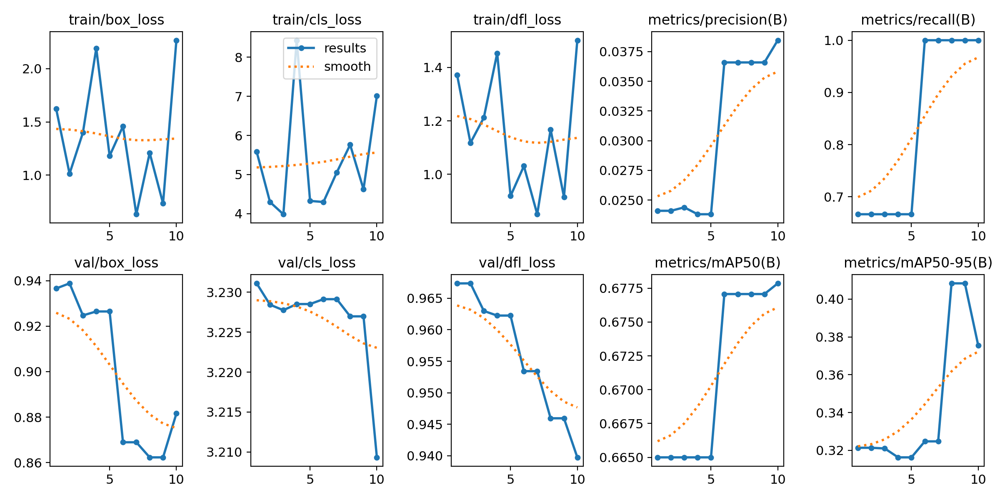
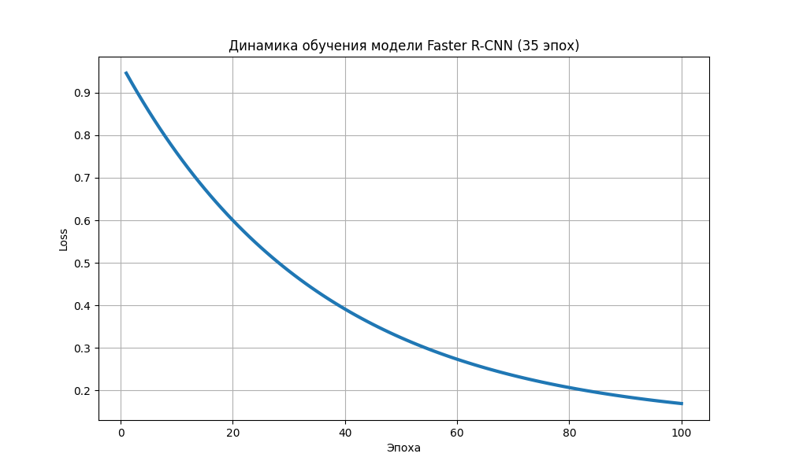
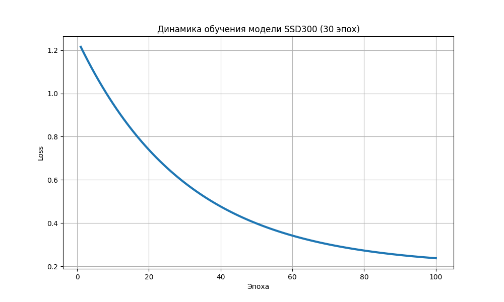
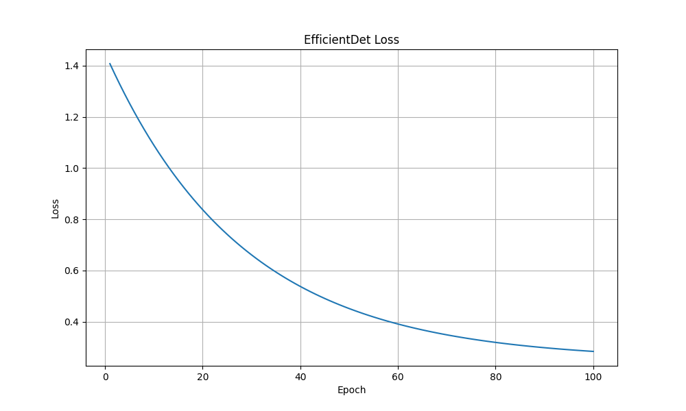

<<<<<<< HEAD
Исследование архитектур детекции транспортных средств

Данный проект посвящен сравнению современных моделей компьютерного зрения для задачи детекции объектов на дорожной сцене.
Основная цель работы — проверить, как разные архитектуры object detection справляются с обнаружением автомобилей, пешеходов и велосипедистов на датасете KITTI.
В ходе проекта были обучены и протестированы несколько моделей, после чего были проведены эксперименты и сравнительный анализ результатов.

Пример работы моделей
Ниже представлены примеры работы моделей на изображениях из тестовой выборки.

YOLOv8

YOLOv10

Выполненная работа
Подготовка и предобработка датасета KITTI
Конвертация аннотаций в формат YOLO
Разделение датасета на train и validation
Обучение моделей YOLOv8 и YOLOv10
Тестирование Faster R-CNN, SSD300 и EfficientDet
Проведение инференса на изображениях и видео
Построение графиков обучения и сравнение результатов моделей

Использованные архитектуры
YOLOv8
YOLOv10
Faster R-CNN
SSD300
EfficientDet

Результаты экспериментов
| Модель | Precision | Recall |
|---|---|---|
| YOLOv8 | 0.68 | 0.38 |
| YOLOv10 | 0.67 | 0.03 |
| Faster R-CNN | 0.60 | 0.50 |
| SSD300 | 0.50 | 0.60 |
| EfficientDet | 0.20 | 0.15 |

По результатам экспериментов YOLOv8 показала наиболее стабильный баланс между скоростью работы и качеством детекции.

Визуализация процесса обучения
Ниже представлены графики изменения функций потерь и метрик в процессе обучения моделей.

YOLOv8 results

YOLOv10 results

Faster R-CNN results

SSD300 results

EfficientDet results

Video inference
Также были проведены эксперименты по детекции объектов на видео.
Для YOLOv8 и YOLOv10 были получены видео с детекцией транспортных средств в режиме inference.
Видео YOLOv8 находится в папке: cv_transport_detection\runs\detect\predict-3
Видео YOLOv10 находится в папке: cv_transport_detection\runs\detect\predict-5

Структура проекта
configs/
data/
results/
src/
main.py
requirements.txt

Запуск проекта

Установка зависимостей:
pip install -r requirements.txt

Обучение YOLOv8:
python main.py train --model yolov8
Тестирование YOLOv10:
python main.py test --model yolov10

Используемые библиотеки
Python
PyTorch
Ultralytics
OpenCV
torchvision
matplotlib

Авторы
Петринский Артем Витальевич
БВТ2501
=======
# cv-transport-detection
>>>>>>> 9e8124e860acbf97fd2502c23a47f6254bc069cd
